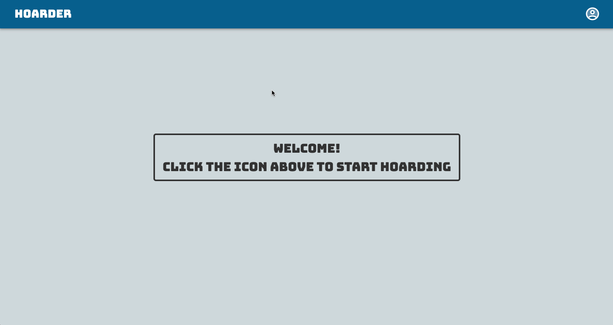

# React Hoarder

Here we have a CRUD web app built with React allowing a User (once signed in) to add new items to their collection. They can delete items they've gotten rid of and edit their details too.

This was also my first try using [Material UI](https://material-ui.com/) as my styled React Components!

## Preview

## Clone the Repository
- Clone it 👉🏼 `$ git clone https://github.com/RyanBeiden/react-hoarder.git`

- Install the dependencies 👉🏼 `$ npm install`

- Run `$ npm start`

## Technologies Used
   
